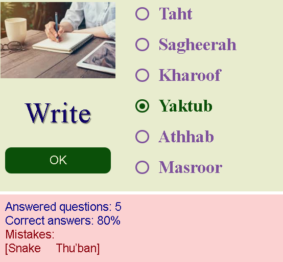

# Arabic words test for Year 1

### Algorithm
The algorithm is simple. It will select one word from collection to be the answer. It will also pull from collection another 5 different (not matching words). Question asked by word pronounceation in Arabic.    
I added picture just for better memorizing and visuals.    
      
This is example:     
   

And this is example on smaller screens:       
 

Even collection consists of more than 100 words, I added previous question check so the same word does not repeat few times.      
### Test it yourself
Live version can be found [here](http://artem-soroka.tk/pages/ara2/ "Arabic test for Year 1").   
     
Thank you.